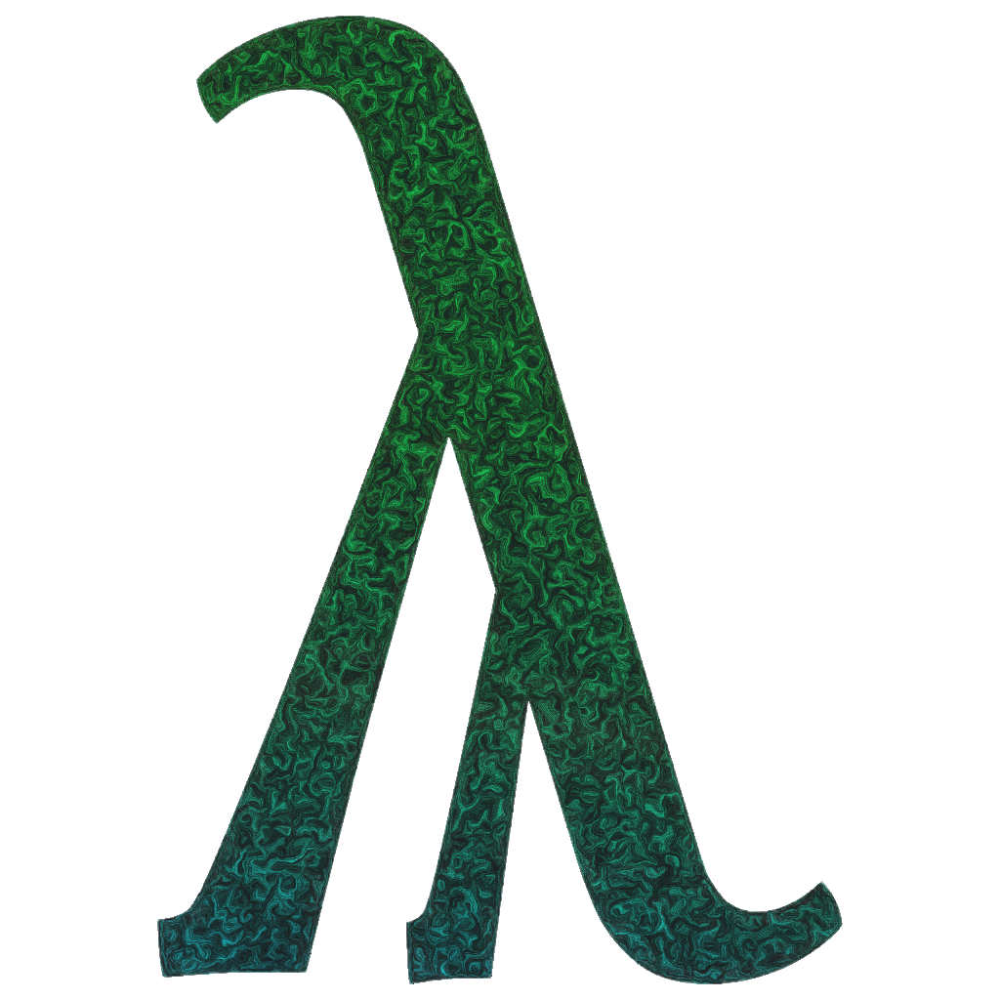

# STELF Project

> "It is only prudent never to place confidence in that by which we have even once been deceived."
>
> René Descartes

The STELF (System for Totality in the Edinburgh Logical Framework), is minimal system designed for creating understandable and completely trustworthy proofs.
STELF is based off the [Twelf Theorem Prover](https://twelf.org).

The best resource for learning about STELF is the [STELF website](https://standardocaml.github.io/).

Some other quick links:

1. [STELF website](https://standardocaml.github.io/)
2. [STELF GitHub](https://github.com/standardocaml)
3. [Twelf website](https://twelf.org)
4. [Twelf GitHub](https://github.com/standardml/twelf)

## Building

> [!WARNING] I have not as of yet tested that this is reproducible, please create an issue if you have a problem

The prerequisites for building STELF most easily is the [opam](https://opam.ocaml.org) package manager and `make`.
Once you have opam installed, to build the project just do `make build`. This should automatically set up your environment, install dependencies and build the project

To install, just do `make install`.

> [!NOTE] You may notice that `dune` starts reporting that the build is getting larger and larger (up to a couple thousand targets (which for dune isn't that much)), or that it seems to be taking a long time on the first couple. This is expected.

### Testing

For end-user testing, just run `make test`.
Developers should use `dune test`.

### Editor Support

Currently, the only editor supported is Zed (because of its interoperability with Tree-sitter) through the [stelf-zed](https://github.com/standardocaml/stelf-zed) extension.

> [!NOTE] Help creating extensions for other editors is greatly appreciated

## Improvements from Twelf

Twelf itself is a powerful tool for reasoning about metatheorems, but it had several limitations and shortcomings

### Ecosystem

Twelf's is arguably one of its weakest points.
Twelf, a Standard ML program, requires an SML compiler, which is a task in itself.
In addition, the Twelf Emacs mode, while not a core part of the project, is not very modernized and is not on `MELPA`, which makes it another setup

STELF is written in OCaml, a modern language in the ML family with a very large ecosystem (that is also the basis of the Rocq project).
Its build is easy and user friendly.

### Composability

Twelf had a large *large* problem with composability.

Firstly, Twelf's module system was never fully implemented (in Twelf, it serves as the basis for the scope system here).
This means that if you wanted to make sure names didn't collide, you had to be sure that they were distinct.
This means names had to either be at least one of (usually both)

- Very, *very* long
- Not descriptive

In addition, Twelf did not have a clear way to import other files or to have libraries.
The configuration system is a list of files to be loaded, in order.
STELF uses a `stelf.toml` file (which is compliant TOML), which fixes all these problems.
In addition, you get the much needed scope feature, allowing names like `%(nat zero)` to be written without aggressively adding dashes

### Candy

The original Twelf, compared to modern languages (including STELF) has a bit of a simple REPL

1. Input and output can't be distinguished in the Twelf REPL (STELF has `=>`, `debug` etc. for output, and `λ∏>` or `>` for input)
2. The Twelf REPL doesn't use color (STELF does))
3. The Twelf REPL doesn't have a command history (STELF does)

## Copyright

Copyright (C) 1997-2011, Frank Pfenning and Carsten Schuermann
Copyright (C) 2026-2026, Asher Frost (Ethan Moy)
